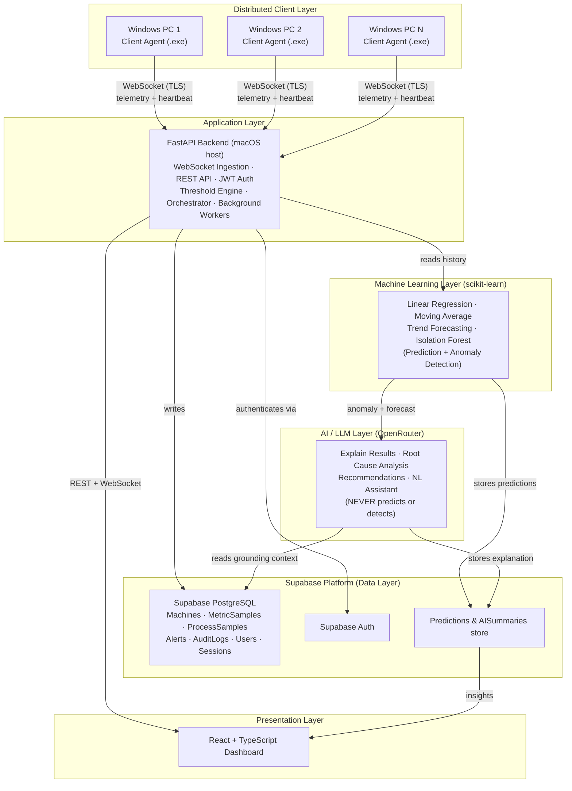
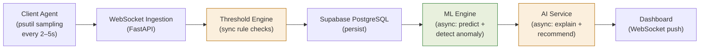
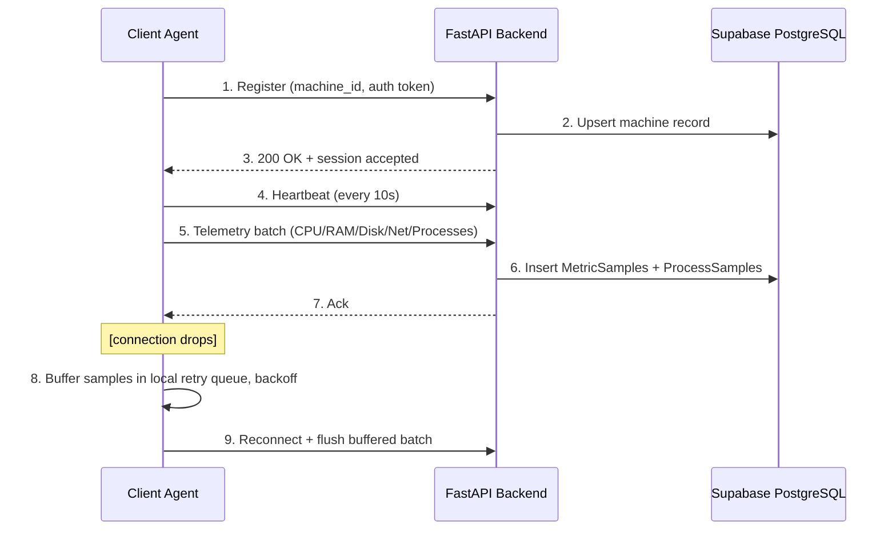
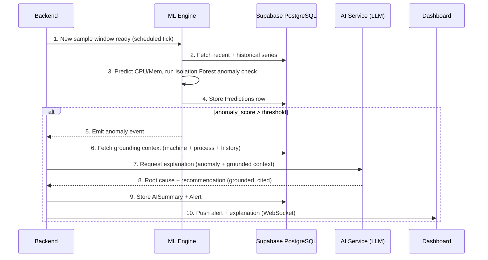
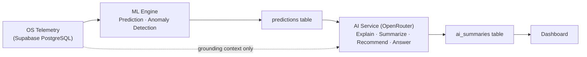
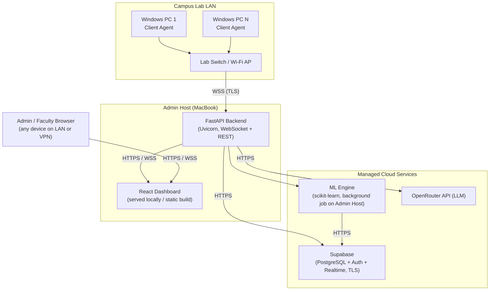

# AI-Driven Distributed Computer Lab Monitoring and Intelligent Resource Management System

**Product Requirements Document — v3.0 (Enterprise Revision)**
**Type:** Operating Systems Capstone Project
**Discipline Weighting:** 70% Operating Systems · 30% AI Enhancement
**Prepared by:** Shaik Rafiqhuddin — SIMATS Engineering, B.Tech CSE (AI & Data Science)
**Date:** July 2026

> **Editorial note on this revision:** This is a review-and-improve pass over v2, not a redesign. No section has been shortened or removed. Every section has been checked for architectural consistency, technical accuracy, and OS-project framing, and expanded where the reviewer requirements in the revision brief called for more depth (Supabase's actual role, the ML layer, the client agent, database design, security, scalability, deployment, and project tooling).

---

## Table of Contents

1. [Executive Summary](#1-executive-summary)
2. [Problem Statement](#2-problem-statement)
3. [Objectives](#3-objectives)
4. [Scope](#4-scope)
5. [Stakeholders and Users](#5-stakeholders-and-users)
6. [Functional Requirements](#6-functional-requirements)
7. [Non-Functional Requirements](#7-non-functional-requirements)
8. [Operating System Concepts Mapping](#8-operating-system-concepts-mapping)
9. [System Architecture](#9-system-architecture)
10. [Component Architecture](#10-component-architecture)
11. [Data Flow](#11-data-flow)
12. [Sequence Diagrams](#12-sequence-diagrams)
13. [Supabase: Role and Justification](#13-supabase-role-and-justification)
14. [Database Design](#14-database-design)
15. [API Specification](#15-api-specification)
16. [Machine Learning Layer](#16-machine-learning-layer)
17. [AI / LLM Architecture](#17-ai--llm-architecture)
18. [AI Feature Catalog](#18-ai-feature-catalog)
19. [Client Agent Design](#19-client-agent-design)
20. [Backend Design](#20-backend-design)
21. [Networking Architecture](#21-networking-architecture)
22. [Dashboard Design](#22-dashboard-design)
23. [Security](#23-security)
24. [Scalability](#24-scalability)
25. [Deployment Architecture](#25-deployment-architecture)
26. [Project Folder Structure](#26-project-folder-structure)
27. [Technology Stack](#27-technology-stack)
28. [Milestones and Deliverables](#28-milestones-and-deliverables)
29. [Risks and Mitigations](#29-risks-and-mitigations)
30. [Success Metrics](#30-success-metrics)
31. [Future Scope](#31-future-scope)
32. [Implementation Notes for Antigravity / MCP Tooling](#32-implementation-notes-for-antigravity--mcp-tooling)

---

## 1. Executive Summary

This document specifies the requirements for an AI-augmented distributed monitoring and resource-management system for a Windows computer lab. At its core, the system is an applied **Operating Systems** project: it observes and reasons about CPU scheduling behavior, process and thread management, virtual memory, disk I/O scheduling, and inter-machine network communication across a fleet of PCs, and persists that data for long-term resource accounting.

A statistical **machine learning layer** (scikit-learn) sits directly on top of this OS telemetry to forecast short-term resource trends and detect anomalous behavior using classical, explainable models — linear regression, moving averages, and Isolation Forest. A **large language model**, accessed via OpenRouter, sits one layer further downstream and is strictly an *explanation and communication* layer: it narrates what the ML layer already found, performs grounded root-cause analysis, and answers natural-language questions. **It never predicts, forecasts, or detects anomalies itself.** This ordering — OS telemetry → ML → LLM — is the single most important architectural invariant in this document and is treated as a hard constraint throughout, not a preference.

The system comprises six independently deployable components: a Windows **Client Agent**, a **FastAPI backend**, a **Supabase PostgreSQL** data platform, a **scikit-learn ML Engine**, an **OpenRouter-backed AI Service**, and a **React/TypeScript dashboard**. This revision corrects an architectural inconsistency present in earlier drafts (the LLM being implicitly responsible for anomaly detection), expands the ML, client agent, database, security, scalability, and deployment sections to production-realistic depth, and adds explicit tooling notes for building the project inside Antigravity using the Supabase, GitHub, and Stitch MCPs.

---

## 2. Problem Statement

Shared computer labs run many concurrent user processes across many machines, and the operating system on each machine is continuously making scheduling, memory-allocation, and I/O-arbitration decisions that determine whether the lab is usable. Administrators currently have no aggregate visibility into these OS-level decisions: they cannot see, in one place, which machines are CPU-bound, which are thrashing on virtual memory, which processes are monopolizing disk or network I/O, or how these conditions evolve over a semester.

Existing remote-monitoring tools expose raw counters (CPU%, RAM%) without connecting them to what the operating system is actually doing, without persisted history, and without any predictive or explanatory capability. The result is **reactive, not preventive**, lab management: problems rooted in OS resource contention — scheduling starvation, memory pressure, disk-queue saturation — are discovered only after they degrade a class session, not before.

---

## 3. Objectives

1. Continuously observe OS-level resource state — CPU scheduling load, process/thread activity, memory allocation and paging, disk I/O, and network I/O — across every lab machine from one console.
2. Persist this OS telemetry as a historical record suitable for resource accounting and semester-long trend analysis.
3. Apply **classical, explainable machine learning** directly to OS telemetry to forecast near-term CPU/memory trends and flag anomalous resource behavior, before any LLM is involved.
4. Use an LLM **exclusively** to translate ML output and raw telemetry into grounded, human-readable explanations, root-cause narratives, and recommendations.
5. Provide administrators a single dashboard for live state, historical analytics, alerts, and natural-language querying of lab/OS state.
6. Demonstrate, section by section, how every system feature maps onto a core Operating Systems concept (Section 8) — this mapping is the project's primary academic justification.

---

## 4. Scope

### 4.1 In Scope — Phase 1 (Core Monitoring + AI)

- Windows Client Agent (.exe) collecting CPU, memory, virtual memory, disk, disk I/O, network, process, thread, and machine-identity telemetry via `psutil`.
- FastAPI backend with WebSocket ingestion, REST API, JWT authentication, and a synchronous threshold-alert engine.
- Supabase PostgreSQL as the system of record, plus Supabase Auth for admin/faculty accounts.
- scikit-learn ML Engine performing CPU/memory prediction, trend forecasting, and anomaly detection.
- OpenRouter-backed AI Service performing grounded explanation, root-cause analysis, recommendations, and natural-language querying.
- React + TypeScript dashboard covering all pages listed in Section 22.

### 4.2 Phase 2 and beyond (see Section 28 for full phase breakdown)

- 3D spatial lab visualization (React Three Fiber) — explicitly demoted from core functionality to a Phase 2/5 enhancement.
- Remote remediation actions, multi-lab federation, adaptive thresholds, RBAC expansion.

### 4.3 Out of Scope

- Non-Windows client agents (macOS/Linux).
- Native mobile applications.
- Student-facing self-service accounts (Phase 1 has admin/faculty roles only).

---

## 5. Stakeholders and Users

| Role | Description | Primary Needs |
|---|---|---|
| Lab Administrator | Owns day-to-day lab operations and OS/hardware health across all machines. | Real-time OS-level state, historical accounting, early warning before degradation. |
| Faculty | Uses the lab for scheduled classes; needs confidence machines will perform. | Fast health-score check before class; no need to interpret raw counters. |
| Academic Evaluator | Assesses the OS capstone submission. | Clear OS concept mapping, correct architecture, working demo, disciplined AI scope. |

---

## 6. Functional Requirements

### 6.1 Multi-Machine Monitoring
- The system shall support concurrent monitoring of multiple registered Windows machines from a single backend instance.
- Each Client Agent shall register with a unique machine ID and authentication token on first run, and reconnect automatically after any network interruption.
- The backend shall maintain a live registry of connected, idle, and offline machines based on heartbeat state.

### 6.2 OS-Level Telemetry Collection
- The Client Agent shall report, per sampling interval: CPU utilization (overall and per-core), physical memory usage, virtual memory/swap usage, disk usage and I/O throughput, network throughput, and machine identity metadata.
- The Client Agent shall report, per process: PID, process name, owning user, CPU%, resident memory, and thread count.
- Sampling interval shall be configurable (default 2–5 seconds).

### 6.3 Live Dashboards
- The dashboard shall present live, auto-refreshing lab-wide and per-machine views without manual reload, via WebSocket push.
- Machines shall be visually differentiated by state: healthy, warning, critical, offline.

### 6.4 Machine Detail & Process Explorer
- Selecting a machine shall reveal its live and historical OS metrics plus a sortable, filterable process table.
- The process explorer shall support inspecting a single process's resource trend over the current session.

### 6.5 Historical Analytics
- All telemetry shall be persisted with timestamps in Supabase PostgreSQL for historical querying and resource accounting.
- The dashboard shall provide time-range trend charts (last hour / day / week) per machine and lab-wide.

### 6.6 Alerts (Threshold + ML-Derived)
- The backend shall raise synchronous threshold alerts (e.g., CPU > 90% sustained, memory > 90%, disk > 95%) independent of ML/AI availability.
- The ML Engine shall raise anomaly alerts when a machine's behavior deviates from its own learned baseline, even without a static threshold breach.

### 6.7 ML-Based Prediction (see Section 16 for full detail)
- The ML Engine shall forecast short-horizon CPU and memory trends per machine using historical time-series data.
- The ML Engine shall compute an anomaly score per machine per evaluation window using Isolation Forest trained on that machine's own history.

### 6.8 AI Explanation Layer (see Sections 17–18)
- The AI Service shall generate a plain-language explanation and likely root cause whenever the ML Engine raises an anomaly, grounded in the retrieved telemetry and prediction that triggered it.
- The AI Service shall generate a periodic natural-language lab health summary and a weekly performance-insights digest.
- The AI Service shall answer free-text administrator questions about current or historical lab/OS state, citing the specific machines and metrics the answer is grounded in.
- The AI Service shall never generate a prediction, forecast, or anomaly determination itself.

---

## 7. Non-Functional Requirements

| Category | Requirement |
|---|---|
| Real-time performance | Live dashboard state shall reflect agent-reported values within 2–3 seconds under normal LAN conditions. |
| Scalability | Backend shall support **100+** concurrently connected agents without degraded update latency (see Section 24). |
| Security | All agent–backend and backend–dashboard traffic shall be TLS-encrypted; all API access shall require JWT authentication; each agent authenticates with a per-machine token (see Section 23). |
| Reliability | Agents shall buffer telemetry locally during connectivity loss and flush on reconnect rather than dropping data. |
| Resource overhead | Agent CPU footprint shall remain under 2% average CPU on the host machine. |
| Modularity | Client agent, backend, ML engine, AI service, and frontend shall be independently deployable, versioned components. |
| Auditability | Every AI-generated explanation and every threshold/ML-derived alert shall be logged to `AuditLogs` with the data it was grounded in. |
| Maintainability | Codebase shall be organized so a new metric, alert rule, or ML feature can be added without touching unrelated modules. |

---

## 8. Operating System Concepts Mapping

This chapter is the project's core academic justification: every observable feature is mapped directly onto the Operating Systems concept it operationalizes. An evaluator should be able to read this table and confirm the project is fundamentally about Operating Systems, with AI as a downstream interpretation layer.

| System Feature | Operating System Concept |
|---|---|
| CPU utilization monitoring (overall + per-core) | **CPU Scheduling** |
| Running process enumeration and control | **Process Management** |
| Per-process thread count | **Multithreading / Thread Scheduling** |
| Physical memory usage tracking | **Memory Allocation / Management** |
| Virtual memory and swap monitoring | **Virtual Memory** |
| Disk I/O throughput and queueing | **Disk Scheduling** |
| File and directory access patterns | **File System Management** |
| Network throughput monitoring | **I/O Management** |
| Client Agent metric collection via `psutil` | **System Calls / Kernel Interfaces** |
| Multi-machine distributed telemetry | **Network Communication / Distributed Systems** |
| Persisted time-series telemetry | **Resource Accounting** |
| Concurrent WebSocket connection handling in the backend | **Concurrency / I/O Multiplexing** |
| Threshold engine evaluating live samples | **Real-Time Resource Monitoring** |
| Machine registration and heartbeat | **Process/Device State Management** |
| Local buffering + retry queue on the agent | **Producer-Consumer Buffering (classic OS synchronization problem)** |
| Background workers processing queued telemetry | **Job Scheduling / Batch Processing** |

Every AI/ML component operates strictly downstream of this OS telemetry layer — it interprets OS state, it does not replace or abstract it away.

---

## 9. System Architecture

The system is organized into six layers: a distributed client layer, an application (backend) layer, a data platform layer (Supabase), a deterministic ML layer, an explanatory LLM layer, and a presentation layer. The layer ordering is deliberate and enforced: **raw telemetry → ML prediction/detection → LLM explanation**. The LLM is never given raw telemetry to predict from; it is only given ML output plus supporting context to narrate.



*Figure 1 — Layered system architecture. Prediction and anomaly detection live exclusively in the ML Layer; the AI Layer consumes ML output and produces explanations only.*

---

## 10. Component Architecture

| Component | Technology | Responsibility |
|---|---|---|
| Client Agent | Python + `psutil`, packaged with PyInstaller | Collects OS-level telemetry; registers machine identity; maintains heartbeat; buffers and retries on reconnect. |
| Backend API | FastAPI + Uvicorn (macOS host) | WebSocket ingestion, REST endpoints, JWT auth, synchronous threshold engine, orchestration of ML/AI calls, background workers. |
| Data Platform | Supabase (PostgreSQL + Auth + Realtime + REST) | System of record: machines, telemetry, alerts, predictions, AI summaries, audit logs, users, sessions. |
| ML Engine | scikit-learn (Python) | Linear regression + moving-average trend forecasting; Isolation Forest anomaly detection; runs on a scheduled interval. |
| AI Service | OpenRouter API (LLM) | Grounded explanation, root-cause narration, recommendations, summaries, NL query answering — **no prediction**. |
| Dashboard | React + TypeScript + TailwindCSS + Chart.js + React Query | Live monitoring, historical analytics, alerts, process explorer, AI assistant, health score, search, settings, logs. |

---

## 11. Data Flow

Telemetry moves through a single directional pipeline from collection to explanation. Threshold checks are synchronous and gate on nothing but the current sample, so alerting availability never depends on ML or LLM uptime; ML and LLM stages run asynchronously against persisted history via background workers.



*Figure 2 — Threshold alerts fire synchronously in-line; ML and LLM stages run asynchronously via background workers and never block ingestion.*

---

## 12. Sequence Diagrams

### 12.1 Registration, Heartbeat, and Telemetry Streaming



### 12.2 Anomaly Detection → ML Prediction → LLM Explanation



*The AI Service's input in step 7 is limited to the anomaly record and retrieved telemetry rows — it has no code path to originate a detection.*

---

## 13. Supabase: Role and Justification

Earlier drafts referred generically to "PostgreSQL." This revision replaces every such reference with **Supabase PostgreSQL** and documents what Supabase actually provides beyond a bare database, since several of those services are used directly by this project:

| Supabase Capability | Used For | Status in this project |
|---|---|---|
| **PostgreSQL** | Primary system of record — all tables in Section 14. | Core, Phase 1. |
| **Auth** | Admin/faculty login, session/JWT issuance, password reset. | Core, Phase 1. |
| **Realtime** | Optional low-effort alternative/supplement to custom WebSocket channels for pushing table-change events (e.g., new alert rows) to the dashboard. | Used selectively — Phase 1 for alerts table changes; the primary live-telemetry stream still runs over the backend's own WebSocket for tighter control over sampling cadence. |
| **REST API (PostgREST)** | Auto-generated REST endpoints over the schema — used for internal tooling/debugging, not the primary client-facing API. | Supporting, Phase 1. |
| **Storage** | Object storage for future file assets (e.g., exported reports, lab layout images for the Phase 2 3D view). | **Future scope**, not used in Phase 1. |

Under the hood, the database engine is standard PostgreSQL — this matters academically because it means the schema, indexing, and query design decisions in Section 14 are ordinary relational-database engineering, not a Supabase-specific abstraction. Supabase is the *hosting and platform* layer; PostgreSQL is the *data model* layer.

---

## 14. Database Design

The schema separates raw OS telemetry from derived intelligence (predictions, summaries), operational audit data, and platform/account data, so each can be retained, indexed, and queried according to its own access pattern. All tables live in Supabase PostgreSQL.

### 14.1 `machines`
| Column | Type | Notes |
|---|---|---|
| machine_id | uuid, PK | Stable identifier assigned at first registration. |
| hostname | text | Reported machine name. |
| auth_token_hash | text | Hashed per-machine authentication token. |
| location_label | text | Optional desk/room label for future spatial view. |
| status | text | `online` / `idle` / `offline`, derived from heartbeat. |
| last_seen_at | timestamptz | Updated on every heartbeat. Indexed. |
| created_at | timestamptz | Registration time. |

### 14.2 `metric_samples`
| Column | Type | Notes |
|---|---|---|
| id | bigserial, PK | |
| machine_id | uuid, FK → machines(machine_id) | Indexed (btree). |
| sampled_at | timestamptz | Indexed; composite index `(machine_id, sampled_at)`; partition candidate at scale. |
| cpu_pct | real | Overall CPU utilization. |
| mem_pct | real | Physical memory utilization. |
| swap_pct | real | Virtual memory / swap utilization. |
| disk_io_read_bps / disk_io_write_bps | real | Disk throughput. |
| net_sent_bps / net_recv_bps | real | Network throughput. |

### 14.3 `process_samples`
| Column | Type | Notes |
|---|---|---|
| id | bigserial, PK | |
| machine_id | uuid, FK → machines(machine_id) | Indexed. |
| sampled_at | timestamptz | Composite index `(machine_id, sampled_at)`. |
| pid | integer | |
| process_name | text | Indexed for search. |
| cpu_pct | real | |
| mem_mb | real | |
| thread_count | integer | |

### 14.4 `predictions`
| Column | Type | Notes |
|---|---|---|
| id | bigserial, PK | |
| machine_id | uuid, FK → machines(machine_id) | Indexed. |
| generated_at | timestamptz | |
| horizon_minutes | integer | Forecast horizon. |
| predicted_cpu_pct / predicted_mem_pct | real | ML Engine output. |
| model_used | text | `linear_regression` / `moving_average` / `isolation_forest`. |
| anomaly_score | real | Isolation Forest output. |
| is_anomalous | boolean | Derived from score threshold. |

### 14.5 `alerts`
| Column | Type | Notes |
|---|---|---|
| id | bigserial, PK | |
| machine_id | uuid, FK → machines(machine_id) | Indexed. |
| source | text | `threshold` or `ml_anomaly`. |
| severity | text | `warning` / `critical`. |
| message | text | |
| created_at / resolved_at | timestamptz | Indexed on `created_at`. |

### 14.6 `ai_summaries`
| Column | Type | Notes |
|---|---|---|
| id | bigserial, PK | |
| scope | text | `anomaly_explain` / `lab_summary` / `nl_query` / `weekly_digest`. |
| related_alert_id | bigint, FK → alerts(id) | Nullable. |
| content | text | LLM output. |
| grounding_ref | jsonb | IDs of the exact telemetry/prediction rows the response was grounded in. |
| created_at | timestamptz | |

### 14.7 `audit_logs`
| Column | Type | Notes |
|---|---|---|
| id | bigserial, PK | |
| actor | text | `system` or admin user id. |
| action | text | e.g., `alert_raised`, `ai_explanation_generated`. |
| reference_id | text | ID of the related record. |
| created_at | timestamptz | Indexed. |

### 14.8 `configurations`
| Column | Type | Notes |
|---|---|---|
| key | text, PK | e.g., `sampling_interval_seconds`, `cpu_threshold_pct`. |
| value | jsonb | Typed configuration value. |
| updated_by | uuid, FK → users(id) | |
| updated_at | timestamptz | |

### 14.9 `users`
| Column | Type | Notes |
|---|---|---|
| id | uuid, PK | Managed by Supabase Auth. |
| email | text, unique | |
| role | text | `admin` / `faculty`. |
| created_at | timestamptz | |

### 14.10 `sessions`
| Column | Type | Notes |
|---|---|---|
| id | uuid, PK | |
| user_id | uuid, FK → users(id) | Indexed. |
| issued_at / expires_at | timestamptz | |
| revoked | boolean | Default `false`. |

**Relationships summary:** `machines` 1—N `metric_samples`, `machines` 1—N `process_samples`, `machines` 1—N `predictions`, `machines` 1—N `alerts`, `alerts` 1—N `ai_summaries` (nullable FK for non-alert-triggered summaries), `users` 1—N `sessions`, `users` 1—N `configurations` (as editor).

---

## 15. API Specification

### 15.1 REST Endpoints

| Method & Path | Purpose | Auth |
|---|---|---|
| `POST /auth/login` | Admin/faculty authentication via Supabase Auth; returns JWT. | None |
| `POST /machines/register` | Client Agent registration; returns session token. | Machine token |
| `GET /machines` | List all machines with current status. | JWT |
| `GET /machines/{id}/history` | Historical telemetry for a machine (time-range query). | JWT |
| `GET /alerts` | List active/recent alerts, filterable by severity/machine. | JWT |
| `GET /predictions/{machine_id}` | Latest ML predictions and anomaly score for a machine. | JWT |
| `POST /ai/query` | Submit a natural-language question; returns grounded answer. | JWT |
| `GET /ai/summary/lab` | Latest AI-generated lab health summary. | JWT |
| `GET /ai/summary/weekly` | Weekly performance-insights digest. | JWT |
| `GET/PUT /settings` | Read/update system configuration (thresholds, intervals). | JWT (admin) |
| `GET /logs` | System/audit log query for the Settings → System Logs page. | JWT (admin) |

### 15.2 WebSocket Channels

| Channel | Direction | Purpose |
|---|---|---|
| `/ws/agent` | Client Agent → Backend | Heartbeat + telemetry batch streaming. |
| `/ws/dashboard` | Backend → Dashboard | Live machine state, alert pushes, AI explanation pushes. |

### 15.3 Rate Limiting

All REST endpoints are subject to per-token rate limiting (default: 60 requests/minute for dashboard JWTs, 1 registration/minute per machine token) to protect the backend from misbehaving clients; see Section 23.

---

## 16. Machine Learning Layer

This section is expanded from earlier drafts to make explicit **why ML precedes the LLM** and exactly which classical techniques are used.

### 16.1 Why Machine Learning Runs Before the LLM

LLMs are language models, not time-series models: they are not reliable at arithmetic trend extrapolation, they cannot be audited the way a regression coefficient can, and asking one to "detect an anomaly" from a table of numbers produces an unverifiable, non-reproducible judgment. Classical ML models, by contrast, are:

- **Deterministic and reproducible** — the same input always produces the same output, which matters for an OS-monitoring system where alert behavior must be predictable.
- **Explainable** — a linear regression coefficient or an Isolation Forest path length can be inspected and justified; an LLM's internal reasoning cannot.
- **Cheap to run frequently** — ML inference runs locally on the admin host with no external API cost or latency, so it can evaluate every machine on every scheduled tick.

The LLM is therefore positioned strictly *after* the ML layer, consuming its output rather than replacing it.

### 16.2 Techniques Used

| Technique | Purpose | Notes |
|---|---|---|
| **Linear Regression** | Short-horizon CPU/memory forecasting from recent lag features. | Fast, interpretable baseline forecaster per machine. |
| **Moving Average** | Smoothing noisy per-sample telemetry before feeding the regressor; also used directly for dashboard trend lines. | Simple rolling window (configurable, default 5 samples). |
| **Trend Analysis** | Slope-of-moving-average used as a feature and as a standalone "is this machine trending upward" signal. | Feeds both prediction and the health score. |
| **Historical Forecasting** | Combines regression + trend to project CPU/memory 5–15 minutes ahead. | Confidence degrades gracefully with insufficient history. |
| **Isolation Forest** | Unsupervised anomaly detection trained per machine on its own historical feature distribution (CPU, memory, disk I/O, process count). | Flags points that are easy to isolate in the feature space — i.e., statistically unusual for *that* machine. |

### 16.3 CPU and Memory Prediction Pipeline

1. Pull the last *N* minutes of `metric_samples` for the machine from Supabase PostgreSQL.
2. Apply moving-average smoothing and compute trend/slope features.
3. Fit/update a lightweight linear regression model (per machine, retrained incrementally) to project CPU% and memory% forward by the configured horizon.
4. Score the current window with the machine's Isolation Forest model; if `anomaly_score` exceeds threshold, mark `is_anomalous = true`.
5. Persist the result to `predictions`; if anomalous, emit an event to the backend orchestrator (see Section 12.2).

### 16.4 Execution Model

The ML Engine runs on a **scheduled interval** (not per-sample), decoupling ML compute cost from the ingestion path, and executes as a background worker process alongside the FastAPI backend (see Section 20).

---

## 17. AI / LLM Architecture

This is the most architecturally sensitive part of the system and is governed by one rule: **the ML Engine predicts and detects; the AI Service explains.** This separation is enforced structurally, not just by convention — the AI Service's prompt construction only accepts ML output and raw grounding context as input; it has no code path that allows it to originate a prediction or anomaly verdict.



### 17.1 Interface Boundary

The backend orchestrator exposes two distinct internal interfaces:

- `ml.predict(machine_id)` / `ml.detect_anomaly(machine_id)` — ML Engine only.
- `ai.explain(anomaly)` / `ai.summarize(scope)` / `ai.answer_query(text)` — AI Service only.

There is no interface that lets a caller request a prediction from the AI Service, and no interface that lets the ML Engine generate natural language. This is enforced at the API contract level.

### 17.2 Grounding Discipline

Every AI Service call receives only: the triggering anomaly/prediction record, the specific telemetry rows that support it, and (for NL queries) retrieved historical data relevant to the question. Every AI Service output is stored with a `grounding_ref` (Section 14.6) pointing to the exact rows it was generated from, so any explanation is independently verifiable against the underlying data. **The LLM must never invent data it was not given.**

---

## 18. AI Feature Catalog

| Feature | Description | Grounded In |
|---|---|---|
| Health Summary | Plain-language digest of a machine's or the lab's current condition. | Latest metric_samples + predictions |
| Root Cause Analysis | Explains *why* an anomaly likely occurred. | Anomaly record + relevant process_samples |
| Explain CPU Spike | Targeted explanation for a CPU threshold/anomaly event. | metric_samples + process_samples window |
| Explain Memory Spike | Targeted explanation for a memory threshold/anomaly event. | metric_samples + process_samples window |
| Process Intelligence | Identifies and classifies the process responsible for abnormal resource use. | process_samples |
| Lab Summary | Aggregate natural-language summary across all machines. | Aggregated metric_samples + alerts |
| Optimization Suggestions | Actionable, non-executing recommendations. | anomaly + prediction context |
| Natural Language Search | Free-text Q&A over current/historical lab state. | Retrieved telemetry relevant to the query |
| Performance Insights | Cross-machine comparative insight (e.g., "which machines run hottest during exam week"). | Historical aggregates |
| Weekly Summary | Scheduled weekly digest of lab health and notable events. | Week's alerts + predictions + summaries |

---

## 19. Client Agent Design

- **Machine Registration:** on first run, generates and registers a unique `machine_id` with the backend, receiving a per-machine authentication token.
- **Heartbeat:** sends a lightweight liveness ping on a fixed interval independent of telemetry batches, so the backend can distinguish *idle* from *offline*.
- **Offline Detection:** the backend marks a machine offline after a configurable heartbeat timeout.
- **Auto-Reconnect:** on connection loss, the agent retries with exponential backoff.
- **Local Buffer + Retry Queue:** telemetry sampled while disconnected is queued locally in a bounded ring buffer (a direct application of the producer–consumer pattern) and flushed **in order** upon reconnect.
- **Config File:** a local config file (`agent.config.json`) controls sampling interval, backend endpoint, and log verbosity without requiring a rebuild.
- **Low CPU Footprint:** sampling and serialization are kept allocation-light to hold agent overhead under the <2% CPU non-functional target.
- **Windows Startup Option:** optional registration as a Windows startup task so monitoring resumes automatically after reboot.
- **PyInstaller Packaging:** distributed as a single `.exe` requiring no separate Python installation on lab machines.

---

## 20. Backend Design

- **Framework:** FastAPI on Uvicorn, chosen for native async WebSocket support alongside REST.
- **Ingestion path:** WebSocket handler validates and persists incoming telemetry, then runs the synchronous threshold engine before returning an acknowledgment.
- **Background Workers:** a scheduler process triggers ML Engine evaluation per machine on a fixed interval, and dispatches AI Service calls only when the ML Engine flags an anomaly or a summary is due — decoupled from the request/response cycle via a task queue.
- **Buffered Ingestion:** high-frequency telemetry writes are batched before database commit to reduce write amplification under load (see Section 24).
- **Auth:** JWT for admin/dashboard sessions (issued via Supabase Auth); per-machine bearer tokens for agent connections.
- **Persistence:** SQLAlchemy models mapped to the schema in Section 14, connected to Supabase PostgreSQL.

---

## 21. Networking Architecture

| Link | Protocol | Purpose |
|---|---|---|
| Client Agent ↔ Backend | **WebSocket (WSS)** | Registration, heartbeat, telemetry streaming — persistent, low-latency. |
| Backend ↔ Dashboard | **WebSocket (WSS)** | Live machine state, alert pushes, AI explanation pushes. |
| Dashboard/Client → Backend | **REST (HTTPS)** | Authentication, historical queries, settings, AI requests only — no live telemetry over REST. |

This split is intentional: anything that must feel instantaneous (telemetry, alerts) rides the persistent WebSocket connections; anything request/response in nature (a historical query, a settings change, an AI question) uses plain REST, which is simpler to cache, rate-limit, and secure independently.

---

## 22. Dashboard Design

The frontend is organized into the following pages:

1. **Dashboard (Lab Overview)** — grid of all machines with health-score badges and status color coding.
2. **Machine Details** — full OS-level metric breakdown for a single machine, live and historical.
3. **Live Metrics** — real-time CPU/memory/disk/network charts per machine via WebSocket subscription.
4. **Historical Analytics** — time-range trend views (hour/day/week) built on persisted telemetry.
5. **Process Explorer** — sortable/filterable live process table per machine with per-process trend drill-down.
6. **Alerts** — unified feed of threshold and ML-derived alerts, filterable by severity and machine.
7. **AI Assistant** — natural-language query box returning grounded, cited answers, plus recommendation feed.
8. **Machine Search** — quick lookup by hostname, ID, or status.
9. **Health Score** — composite, explainable score per machine derived from current metrics, active alerts, and anomaly score.
10. **Settings** — sampling interval, thresholds, and other `configurations` table values.
11. **System Logs** — audit log viewer for administrators.

> **3D Lab View has been moved to Phase 2** (see Section 28 and Section 31) and is not part of the core Phase 1 dashboard.

---

## 23. Security

- **JWT Authentication** for all dashboard/admin API access, issued via Supabase Auth, with short-lived access tokens.
- **Per-Machine Authentication:** each Client Agent authenticates with a unique token issued at registration; tokens are hashed at rest.
- **Transport Security:** TLS on all traffic, including agent–backend, backend–dashboard, and backend–Supabase/OpenRouter links (**Secure WebSockets — WSS**, not plain WS, everywhere).
- **API Keys:** OpenRouter and Supabase service credentials held server-side only, never exposed to the client agent or dashboard bundle.
- **Audit Logs:** every alert, prediction event, and AI-generated explanation is recorded in `audit_logs` for traceability.
- **Rate Limiting:** per-token request limits on all REST endpoints (Section 15.3) to prevent abuse or accidental overload from a misbehaving agent.
- **Least Privilege:** the dashboard and agent each receive scoped tokens — an agent token can only write its own machine's telemetry, never read another machine's data.

---

## 24. Scalability

The system is designed to support **100+ concurrently connected machines**, well beyond a typical single-lab deployment, so it comfortably handles a full lab plus headroom:

- **Asynchronous processing:** FastAPI's async WebSocket handlers accept many concurrent agent connections without one-thread-per-connection overhead.
- **Background workers:** ML evaluation and AI calls run in separate worker processes/tasks from the ingestion path, so a slow LLM response never backs up telemetry ingestion.
- **Buffered ingestion:** telemetry writes are batched (configurable batch window, e.g., 1–2 seconds) before committing to Supabase PostgreSQL, reducing per-sample write overhead at scale.
- **Queue processing:** anomaly events and AI requests are placed on an internal task queue rather than processed inline, smoothing load spikes when many machines trend abnormal simultaneously.
- **Caching:** frequently read, slow-changing data (machine registry, current configuration) is cached in-process and invalidated on change, reducing redundant database round-trips for dashboard polling.

---

## 25. Deployment Architecture



*Figure — Deployment topology across lab LAN, admin host, and managed cloud services.*

### 25.1 Environments

| Environment | Description |
|---|---|
| **Development** | Local backend + local Vite dev server + a dedicated Supabase project (free tier); agents point at `localhost` or a dev LAN address. |
| **Local Lab Deployment (Demo/Production)** | Backend and dashboard run on the admin MacBook on the campus LAN; Client Agents are pushed to lab PCs as a signed `.exe`; Supabase and OpenRouter remain cloud-hosted. |

### 25.2 Component Deployment Notes

- **Client Agent (.exe):** distributed via shared network drive or USB during initial rollout; Windows Startup option enables persistence across reboots.
- **Backend:** run via `uvicorn` process manager on the admin host; environment variables hold Supabase and OpenRouter credentials.
- **Frontend:** built as a static bundle and served by the backend (or a lightweight static server) so faculty/admin devices only need a browser.
- **Supabase:** managed project; schema and migrations tracked in `database/` and applied via the Supabase CLI/MCP (Section 32).
- **OpenRouter:** accessed via server-side API key only; never called directly from the client agent or browser.

---

## 26. Project Folder Structure

```
ai-lab-monitor/
├─ client-agent/         # Python + psutil, PyInstaller build
│  ├─ src/
│  ├─ build/
│  ├─ agent.config.json
│  └─ requirements.txt
├─ backend/              # FastAPI application
│  ├─ app/
│  │  ├─ api/            # REST routers
│  │  ├─ ws/             # WebSocket handlers
│  │  ├─ models/         # SQLAlchemy models
│  │  ├─ services/       # threshold engine, orchestrator, workers
│  │  └─ auth/
│  └─ requirements.txt
├─ ml-engine/             # scikit-learn prediction + anomaly detection
│  ├─ models/
│  ├─ training/
│  └─ inference/
├─ ai-service/            # OpenRouter LLM explanation layer
│  ├─ prompts/
│  └─ grounding/
├─ frontend/              # React + TypeScript dashboard
│  ├─ src/
│  │  ├─ components/
│  │  ├─ pages/
│  │  └─ hooks/
│  └─ package.json
├─ database/              # Supabase PostgreSQL schema + migrations
├─ shared/                # shared types/schemas across services
├─ config/                # environment configs (dev/prod)
├─ scripts/                # deployment/build/dev helper scripts
├─ docs/                  # architecture docs, this PRD, diagrams
└─ .github/                # CI workflows, issue templates
```

---

## 27. Technology Stack

| Component | Technology |
|---|---|
| Client Agent | Python 3.x, `psutil`, PyInstaller |
| Backend | FastAPI, Uvicorn, WebSockets, SQLAlchemy, background task workers |
| Database / Platform | Supabase (PostgreSQL, Auth, Realtime, REST) |
| Machine Learning | scikit-learn (Linear Regression, Isolation Forest, moving-average utilities) |
| AI Service | OpenRouter API (LLM access) |
| Frontend | React, TypeScript, TailwindCSS, Chart.js, React Query |
| Phase 2 | React Three Fiber (3D lab visualization) |

---

## 28. Milestones and Deliverables

### Phase 1 — Core Monitoring
- Client Agent (.exe) with registration, heartbeat, buffering, retry queue.
- Backend ingestion, threshold engine, Supabase schema live.
- Basic dashboard: Lab Overview, Machine Details, Live Metrics, Historical Analytics.

### Phase 2 — AI Features
- ML Engine: prediction + anomaly detection operational.
- AI Service: explanation, summaries, NL query, grounded via `grounding_ref`.
- Alerts page unified across threshold + ML sources.

### Phase 3 — Dashboard
- Process Explorer, AI Assistant, Health Score, Machine Search, Settings, System Logs completed.
- Full React Query integration for caching/refetching.

### Phase 4 — Deployment
- Production configuration for Supabase and OpenRouter.
- Local Lab Deployment validated across a real multi-PC lab.
- Security hardening pass (rate limiting, audit logging review).

### Phase 5 — Future Enhancements
- 3D Lab Visualization (React Three Fiber).
- Remote remediation actions, multi-lab federation, adaptive thresholds, RBAC expansion (Section 31).

---

## 29. Risks and Mitigations

| Risk | Impact | Mitigation |
|---|---|---|
| ML model needs sufficient history before predictions are reliable | Medium | Fall back to threshold-only alerting until a machine has enough baseline samples; surface confidence alongside predictions. |
| LLM latency affects perceived responsiveness of explanations | Medium | Dispatch AI Service calls asynchronously via background workers; threshold alerts remain instant and independent. |
| Client agent overhead impacts lab PCs | Medium | Lightweight `psutil` sampling, tunable interval, early benchmarking against the <2% CPU target. |
| Network interruptions cause telemetry gaps | Low–Medium | Local buffering + retry queue with ordered flush on reconnect. |
| AI hallucination in explanations or NL answers | Medium | Structural grounding — AI Service only receives retrieved telemetry/ML output; every output stores its `grounding_ref`. |
| Scope creep toward a pure AI project | Medium | Section 8's OS mapping and Section 17's ML/LLM boundary are treated as hard constraints across all future feature additions. |
| Supabase free-tier limits under 100+ machine load testing | Low | Batched/buffered writes (Section 24) reduce write volume; upgrade tier only if sustained load testing requires it. |

---

## 30. Success Metrics

- Dashboard reflects live state within the 2–3 second target under normal LAN conditions.
- ML Engine correctly flags at least one seeded anomaly scenario (e.g., simulated memory leak) before it reaches a critical threshold, and the AI Service produces a grounded explanation for it.
- Every AI-generated explanation is traceable to specific stored telemetry via its `grounding_ref`.
- Client Agent runs a full demo session without crashing or measurably degrading host performance.
- The Section 8 OS-mapping table can be defended feature-by-feature in an academic evaluation.
- Backend sustains 100+ simulated concurrent agent connections in a load test without exceeding the 2–3 second update-latency target.

---

## 31. Future Scope

- **3D spatial lab visualization** (React Three Fiber), rendering machine status against real desk layout.
- **Remote remediation actions** (restart process, flush cache) gated behind explicit admin confirmation and full audit logging.
- **Multi-lab and multi-campus federation** with a lab-selector view.
- **Adaptive alert thresholds** learned per machine rather than globally fixed.
- **Role-based access control** distinguishing admin, faculty read-only, and future student-facing views.
- **Supabase Storage** integration for exported reports and lab layout images (supporting the Phase 2 3D view).

---

## 32. Implementation Notes for Antigravity / MCP Tooling

This section documents how the project is intended to be built inside Antigravity using available MCP servers, for implementation-phase reference rather than as a requirement on the system itself.

| MCP | Used For |
|---|---|
| **Supabase MCP** | Creating and iterating on the database schema (Section 14), running migrations, inspecting table state directly from the coding environment instead of the Supabase web console. |
| **GitHub MCP** | Managing the repository: issues per milestone (Section 28), a project board tracking Phase 1–5 status, and keeping the `README.md` and `docs/` folder in sync with this PRD as implementation proceeds. |
| **Stitch MCP** | Generating and iterating on React UI layouts — the Lab Overview grid, Machine Details panels, and other dashboard components in Section 22 — before wiring them to live data. |

**Suggested workflow:** define the Supabase schema first via the Supabase MCP (so the backend has a real data model to build against), scaffold dashboard layouts via the Stitch MCP in parallel, then track both efforts against GitHub MCP-managed issues mapped to the Phase 1–5 milestones in Section 28.
