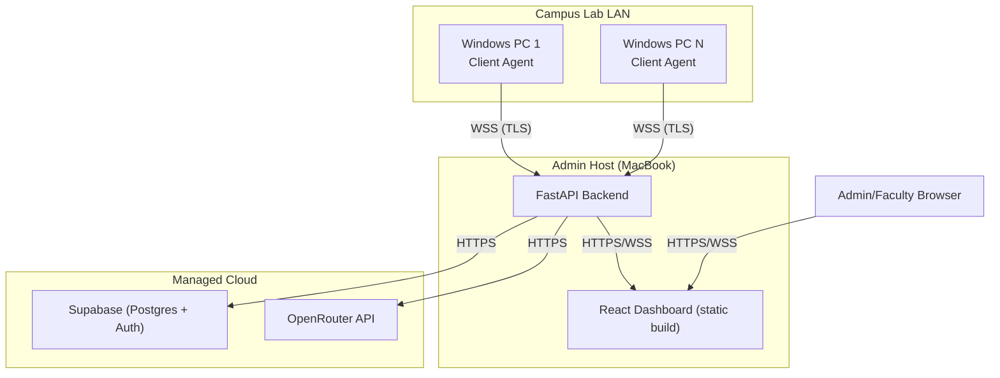

# Deployment

## Environments

| Environment | Description |
|---|---|
| **Development** | Local backend + local Vite dev server + dedicated Supabase project (free tier). Agents point at `localhost` or dev LAN address. |
| **Local Lab Deployment (Demo/Production)** | Backend + dashboard run on admin MacBook on campus LAN. Client Agents pushed to lab PCs as signed `.exe`. Supabase + OpenRouter remain cloud-hosted. |

## Deployment Topology



## Component Deployment

- **Client Agent (.exe):** distributed via shared network drive or USB for initial rollout. Windows Startup option enables persistence across reboots. See `agent.config.json` in `TRD.md` §3.2.
- **Backend:** `uvicorn app.main:app --host 0.0.0.0 --port 8000 --workers 2` behind a TLS-terminating reverse proxy on the admin host.
- **Frontend:** `npm run build` → static bundle served by the backend or a lightweight static server on the same host.
- **Supabase:** managed project; schema/migrations in `database/migrations/`, applied via `supabase db push`.
- **OpenRouter:** accessed via server-side API key only — never called from the client agent or browser directly.

## Environment Variables (Backend)

```
SUPABASE_URL=
SUPABASE_SERVICE_ROLE_KEY=
SUPABASE_ANON_KEY=
JWT_SECRET=
JWT_EXPIRY_MINUTES=60
OPENROUTER_API_KEY=
OPENROUTER_MODEL=
AGENT_HEARTBEAT_TIMEOUT_SECONDS=30
SAMPLING_INTERVAL_DEFAULT_SECONDS=3
ML_EVAL_INTERVAL_SECONDS=60
CPU_THRESHOLD_PCT=90
MEM_THRESHOLD_PCT=90
DISK_THRESHOLD_PCT=95
RATE_LIMIT_DASHBOARD_RPM=60
RATE_LIMIT_AGENT_REGISTER_RPM=1
```

Dev overrides: `config/dev.env`. Prod overrides: `config/prod.env`. Loaded by `scripts/start_dev.sh` / `scripts/start_prod.sh` respectively — never commit real secrets, only `.env.example`.

## Deploy Steps (Local Lab Deployment)

1. `supabase db push` against the production Supabase project.
2. Set `config/prod.env` with production Supabase + OpenRouter credentials, TLS cert paths.
3. `scripts/start_prod.sh` — starts backend with prod env, serves built frontend.
4. Build client agent: `pyinstaller --onefile --noconsole agent_main.py`.
5. Push `.exe` + `agent.config.json` (pointed at prod `wss://` URL) to each lab PC.
6. Verify each machine appears in the Lab Overview dashboard within one heartbeat interval.

## Rollback

Schema changes are additive-first (new columns nullable / new tables) to avoid breaking a running agent fleet mid-deployment. Revert by redeploying the previous backend build; Supabase migrations are not auto-reverted — a down-migration must be written and applied manually if a schema rollback is required.

## CI

`.github/workflows/ci.yml` runs lint + unit tests on push and a PyInstaller build check on tag. See `CONTRIBUTING.md`.
