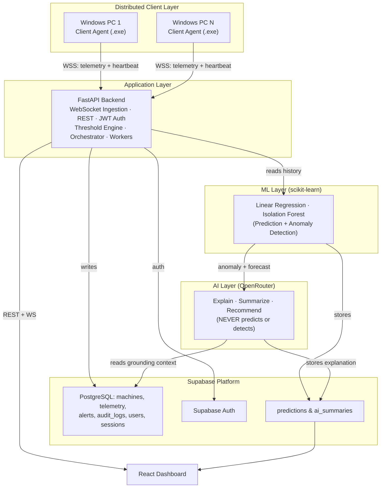
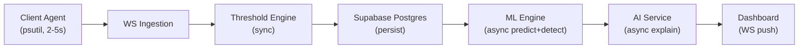
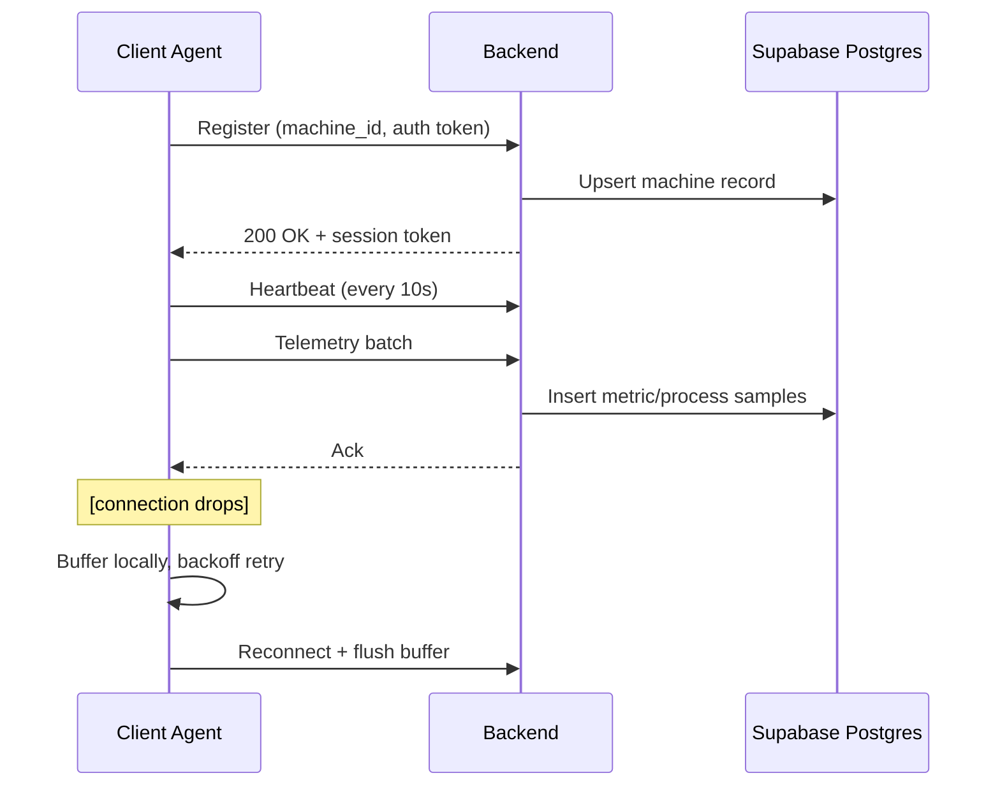
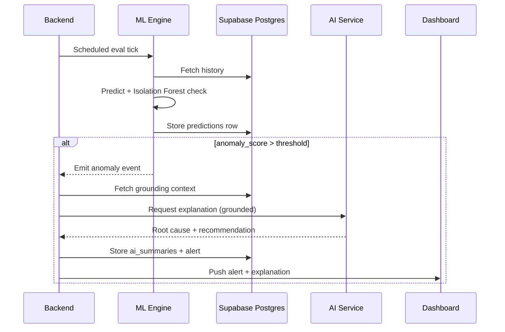

# System Architecture

Operating Systems capstone project. 70% OS / 30% AI enhancement. Full requirements: `../PRD.md`. Exact contracts: `API_SPEC.md`, `DATABASE_SCHEMA.md`.

## Layered Architecture

Six layers: distributed client → application (backend) → data platform (Supabase) → deterministic ML → explanatory LLM → presentation. Non-negotiable ordering: **raw telemetry → ML prediction/detection → LLM explanation**. The LLM never receives raw telemetry to predict from — only ML output plus grounding context to narrate.

## Component Responsibilities

| Component | Tech | Responsibility |
|---|---|---|
| Client Agent | Python + psutil, PyInstaller | Collect OS telemetry, register identity, heartbeat, buffer/retry |
| Backend | FastAPI + Uvicorn | WS ingestion, REST, JWT auth, threshold engine, orchestration, workers |
| Data Platform | Supabase (Postgres + Auth + Realtime + REST) | System of record — see §Supabase Role |
| ML Engine | scikit-learn | Prediction (Linear Regression) + anomaly detection (Isolation Forest) |
| AI Service | OpenRouter LLM | Grounded explanation, summaries, NL query — no prediction |
| Dashboard | React + TS + React Query | All UI views |

## Data Flow

Threshold alerts fire synchronously in-line; ML + LLM stages run asynchronously via background workers and never block ingestion.

## Sequence: Registration → Heartbeat → Telemetry

## Sequence: Anomaly → ML → LLM → Alert

## Supabase Role

| Capability | Used For | Phase 1 status |
|---|---|---|
| PostgreSQL | System of record, all tables | Core |
| Auth | Admin/faculty login, JWT issuance | Core |
| Realtime | Supplemental push for `alerts` table changes | Selective — primary telemetry still on custom WS for sampling-cadence control |
| REST (PostgREST) | Internal tooling/debugging | Supporting |
| Storage | Exported reports, Phase 2 lab layout images | Future scope, not used |

Under the hood the engine is standard PostgreSQL — schema/indexing decisions (`DATABASE_SCHEMA.md`) are ordinary relational design, not Supabase-specific.

## Operating System Concepts Mapping

Core academic justification — every feature maps to an OS concept.

| Feature | OS Concept |
|---|---|
| CPU utilization monitoring | CPU Scheduling |
| Process enumeration | Process Management |
| Thread count | Multithreading / Thread Scheduling |
| Memory usage tracking | Memory Allocation |
| Swap monitoring | Virtual Memory |
| Disk I/O throughput | Disk Scheduling |
| File/directory access | File System Management |
| Network throughput | I/O Management |
| Agent metric collection via psutil | System Calls / Kernel Interfaces |
| Multi-machine telemetry | Network Communication / Distributed Systems |
| Persisted time-series | Resource Accounting |
| Concurrent WS handling | Concurrency / I/O Multiplexing |
| Threshold engine | Real-Time Resource Monitoring |
| Registration + heartbeat | Process/Device State Management |
| Local buffer + retry queue | Producer-Consumer Buffering |
| Background workers | Job Scheduling / Batch Processing |

## ML / LLM Boundary Enforcement

Backend orchestrator exposes two distinct interfaces:
- `ml.predict(machine_id)` / `ml.detect_anomaly(machine_id)` — ML Engine only.
- `ai.explain(anomaly)` / `ai.summarize(scope)` / `ai.answer_query(text)` — AI Service only.

No interface lets a caller request a prediction from the AI Service. Enforced at the API contract level, not convention. See `SECURITY.md` for credential isolation between services.
